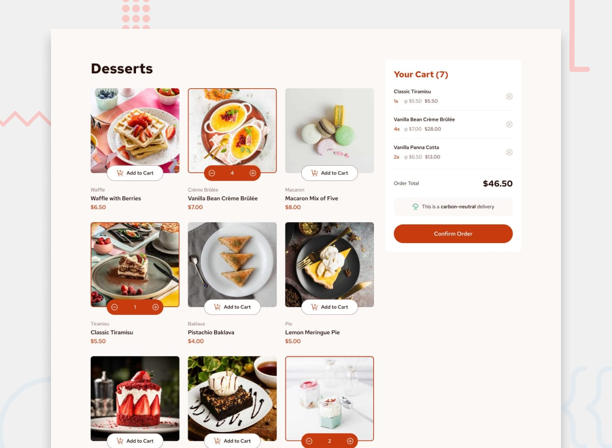

# Frontend Mentor - Product list with cart solution

This is a solution to the [Product list with cart challenge on Frontend Mentor](https://www.frontendmentor.io/challenges/product-list-with-cart-5MmqLVAp_d). Frontend Mentor challenges help you improve your coding skills by building realistic projects.

## Table of contents

- [Overview](#overview)
  - [The challenge](#the-challenge)
  - [Screenshot](#screenshot)
  - [Built with](#built-with)
  - [Running the project](#running-the-project)

# Overview

## The challenge

Users should be able to:

- Add items to the cart and remove them
- Increase/decrease the number of items in the cart
- See an order confirmation modal when they click "Confirm Order"
- Reset their selections when they click "Start New Order"
- View the optimal layout for the interface depending on their device's screen size
- See hover and focus states for all interactive elements on the page

## Screenshot



## Built with

- Semantic HTML5 markup
- Sass
- Flexbox
- CSS Grid
- Mobile-first workflow
- JavaScript (ES6)

## Running the project

### Setting up local server

This project uses ES6 modules for better component reusability. This means you can not open the `index.html` in the browser file via its `file://` URL, due to browser security restrictions (Chrome blocks ES module imports when opening files directly from the filesystem without a server).

So, in order to view the page correctly, you will need to run a local server. Here are some quick options:

#### Option 1: Python Simple HTTP Server

If you have Python3 installed, run:

```
python3 -m http.server 8000
```

#### Option 2: VS Code Live Server Extension

Install the Live Server extension in VS Code.

Right-click index.html → Click "Open with Live Server".

Your file will open at http://127.0.0.1:5500/index.html.

#### Option 3: Node.js with http-server

If you have Node.js installed:

Install a simple HTTP server:

```
npm install -g http-server
```

Navigate to your project folder and run:

```
http-server .
```

Open the URL shown in the terminal (e.g., http://localhost:8080).

## Handling styling with Sass

Follow these instructions to insall and configure Sass, in order to view and manage styles for this project https://www.freecodecamp.org/news/how-to-use-sass-with-css/.
